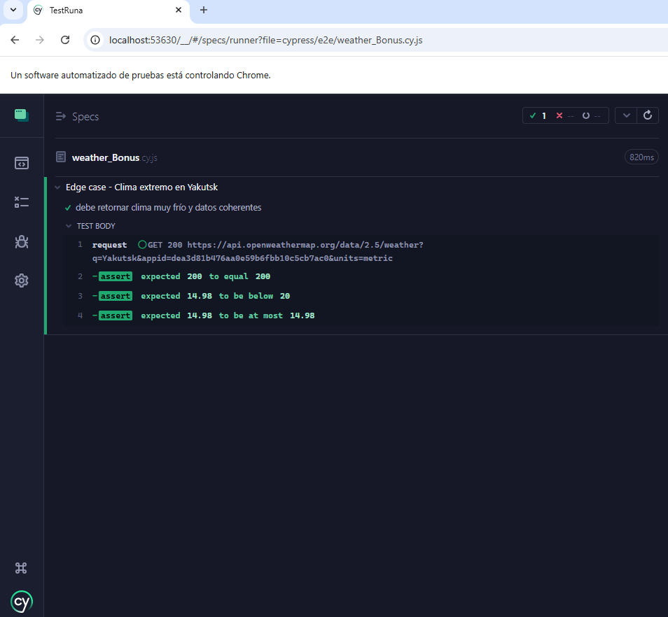

**1. Breve descripción de tu plan de pruebas y selección de escenarios**

En el plan de prueba de prueba se puede observar los escenarios de prueba automatizados, herramientas utilizadas, las validaciones realizadas y documentación sobre posible integración con CI/CD.
Los escenarios fueron seleccionados a partir de la documentación de la prueba a realizar.

**2. Demostración de las pruebas automatizadas**

**Cypress**

**Cypress**

**Cypress**

**Cypress**

**3. Explicación de estructura de código y decisión estratégica**

Se tiene organizado el framework de prueba utilizando Cypress para automatizar validaciones de la API Open WeatherMap.
Se organizó la estrategia de la automatización en una única suite de prueba que componen 2 tests.
Los mismos hacen un get de clima por nombre de ciudad, un get por coordenadas de ciudad y una reproducción de error esperado (404).
En los tres tests se valida código de respuesta HTTP, también se valida tiempo de respuesta y el esquema de respuesta.

Se realiza una sola suite para estas validaciones ya que en cuanto al código sería más fácil de mantener, para integración del repositorio con un pipeline de CI/CD y se reduce los tiempos de ejecución.

Se elegió Cypress porque funciona tanto para validar backend así como también frontend.

**4. Resultados de pruebas claramente visibles**

**Prueba UNO**

**Prueba DOS**

**Prueba TRES**

**5.Demostración de la integración del bonus**

**Script**

**Cypress**

**6. Breve discusión sobre cómo escalaría o expandiría esta solución para un proyecto más grande**

Con este framework se pudiera organizar en una carpeta llamada APIs o Backend y dentro de la mismas sub-carpetas por cada API a validar, así no se mezclarían las pruebas.
Otra carpeta llamada Frontend y dentro de la misma otras sub-carpetas de las aplicaciones web a validar.

Es esencial mantener una buena organización, así son totalmente eficientes para una escabilidad exitosa.

Además que utilizaríamos un mismo framework y un mismo lenguaje.